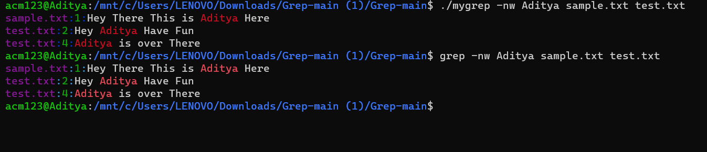

# GREP [Global Regular Expression Print]
DSA MINI PROJECT !<br><br>
Aim: To search a particular string in a single or multiple files .<br>

### Installation

1. Clone the repo

```
https://github.com/Adityamagar/Grep.git
```
2. Move Into Working Directory

```
cd grep
```

3. Build The Project

```sh
make
```

4. Run The Project

```
./mygrep [Option] Pattern [File Names]
```

<h2>Sample Image which show 'mygrep' Vs 'grep'</h2>


